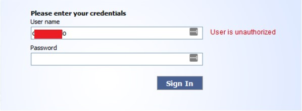

# Credentials Validation without authentication

As I said in my [first post](../20180419/purpose), the reason I decided to start a blog was a flaw that I've found in one of the Check Point appliances. Because I want to register a CVE, I'm required to have a public PoC explaining the vuln. So, here it is... 

## What I discovered?

Basicaly I found a way to validate credentials in the login page of the Check Point VPN appliance. By validate I mean that I can know whether a pair username:password is valid or not inside the web application without the need of authentication.

## How I discovered it?

I was doing a pentest in a public organization in my country and I decided to do some manual enumeration in the login page of the VPN appliance. First I saw that the webapp displays an error message (*Access denied - wrong user name or password*) when I tried to input some random credentials:

 So far nothing wrong. Things started to bother me when I used some credentials I got in a phishing campaign in the login page and the webapp showed me a different message (*User is unauthorized*):

I wasn't able to login into the webapp, but I got a different error message than before... This is at least a weird behavior. So based on this, I tried some combinations: wrong_username:valid_password, valid_username:invalid_password, invalid_username:invalid_password. In all of these attempts I got the first error message. Only when I used a credential from the ones I got from the phishing campaign I was able to receive the second message. So, based on this, I concluded that those credentials must exist somewhere inside the appliance, in a database, but the user isn't allowed to login.

## Okay, but how can a bad guy take advantage of it?

That's the simple part. Really. If an attacker is targeting a company that uses this appliance, he can build a social engineering campaign to gather as much information as possible about all of the employees and he can also create a custom wordlist using these information in order to attempt an online dictionary attack in the login page. This way he can separate all of the credentials that produce the second error message. These credentials can then be used in further attacks. In my case, I could use those credentials to gain access to the user's webmail.

***

Well, that's it. I hope I made myself clear about this Poc. I'll update this post when my request for a CVE is answered.

## UOLAYFIRERTRUAESBEILHIDUBGSCNOKLYFUROUSOECYACSSSTUSNOIKHOYLHOSAUEBMLOEC
