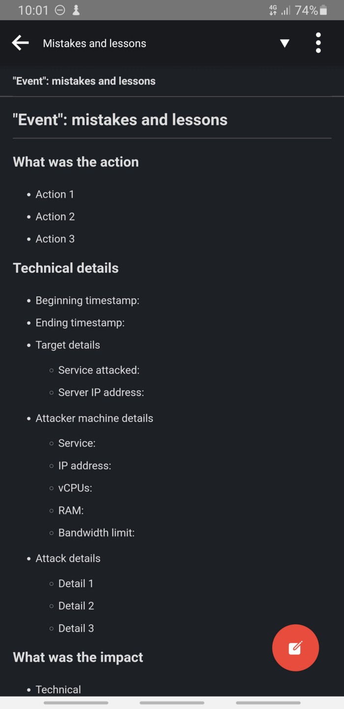

# Introduction

In both my personal and professional lives I try my best to live by a simple statement: “Your failures are the building blocks of your success”. But having a nice motivational quote means nothing if it stays only on paper (or screen). So, for a while now I had this idea of actually convert its meaning into action and the perfect opportunity had just knocked on my door.

You see, last month I began a new professional challenge: to lead a red team. I’m not diving into what a red team is, but I now have a job where I must technically guide the team while planning and executing our projects and developing ourselves.

Very recently me and my team mate [Gustavo Viana](https://www.linkedin.com/in/gustavoviana1) performed a certain engagement against our company. The action lasted for about half an hour and as soon as it ended, we were approached by our manager: “I was just asked if the Red Team was doing something on our \<service name\>. Are you?”

It was at this moment we knew: we fu….ed up.

On the same day, after all the dust settled, I realized that this particular incident could be the one that would turn this old idea of mine into something actually useful: to be able to register my professional mistakes so I could really make them the building blocks of my professional success.

However, now I’m not just a member of my team. I lead it. So guided by that thought, I saw that I could extend my idea to the whole team and make it a methodology.

# First things first

Before I begin to walk you through the process, I have to tell you that all of this is completely useless if you can’t come forward on your own mistakes. Be humbled by the fact that you’re human, imperfect in every possible way, and you make mistakes every time. The great thing about being human, though, is that you can learn from not just your own mistakes, but from others.

# What to register?

Well, everything you can think it’s important to detail exactly what happened, when it happened and why it went wrong. You also want to include every single technical detail about the environment, the technical and business impacts your team’s mistake created, the consequences generated, negative and positive, and, of course, the lessons learned from the event.

# Where to register?

Personally, I use Joplin for note taking, so I just created a new notebook under my companies main notebook. Each note means one event where mistakes were made. Now, one thing I had in mind is the fact that I’m not doing that just for me, but for my whole team. So the ideal situation is if or those notes to be available for everyone on the team. My only warning here is that the notes must be stored in a safe place.

# The note template

Below you can see the note template I created in Joplin with the help of my colleague:

# How to fill in the topics?

What I recommend for the topics “Action”, “Technical details”, “Impact” and “Consequences” is that you gather as much information as possible, so you have them rich in details. This will help to remember the event in the future. Also, involve the team in the process. They can help you to grow the details and even add more information.

As for the remaining topics, the most important ones, it’s highly recommended that you do a brainstorming session with the whole team (not only the members who participated in the event) so all the possible mistakes and lessons can be extracted.

# The methodology

As a team leader, I’d like this methodology to be part of the team’s day to day, so everyone knows what needs to be done and why. Because of that, I came up with some rules that I think are essential for this to work as intended:

1.  All the notes and brainstorming sessions are restricted only to the team.
2.  Absolutely no names must be mentioned. The purpose here is not to register who made the mistake, but learn from it.
3.  The team leader must ensure that nobody is bullied for making a mistake. As I already said: mistakes are great opportunities for learning and they must be treated this way if you want a more mature team. So it’s your responsibility as a leader to plant that mindset seed inside the team’s head.
4.  The notes must be securely stored and accessed.
5.  This is optional: I recommend that every new member of the team go through all the existing notes, so they can see what the team has already gone through and all the good lessons they’ve learned. It’s a great way for the newcomers to also learn those lessons, but without having to make the same mistakes.

# Final thoughts

Imagine if every team had a methodology for learning from its own mistakes. Imagine what great lessons are now lost because people think mistakes are ugly and embarrassing things that must be pushed under the carpet.

It’s really great to have a way to register those tense moments and all the mistakes and the lessons taken from them. I hope that with this post I can plant the mindset I so much appreciate into people’s minds.
